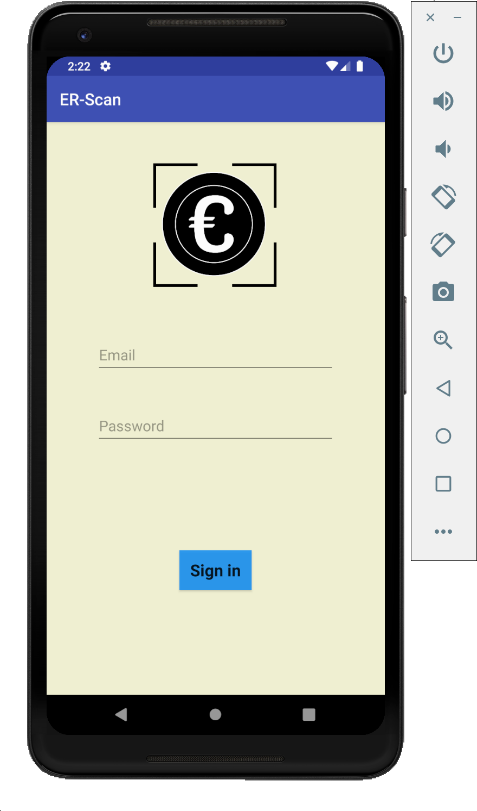
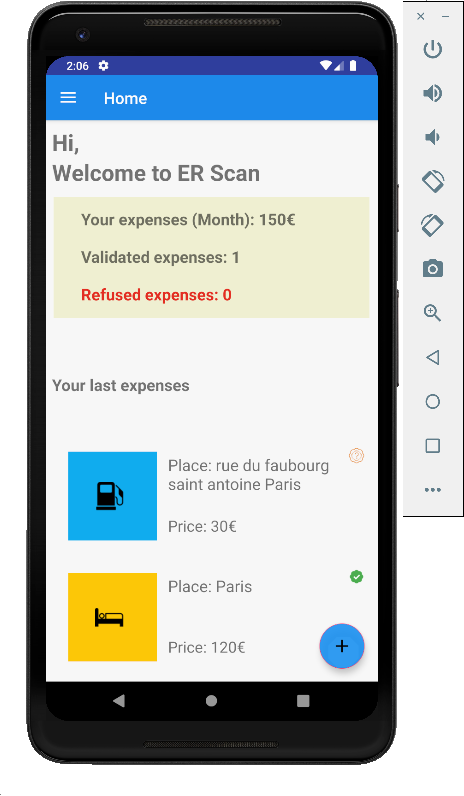
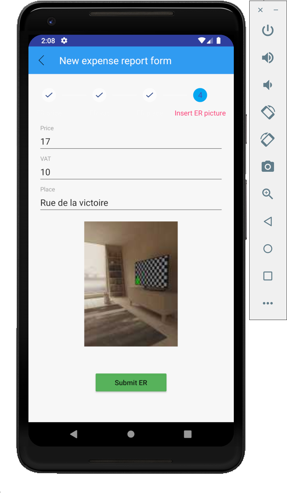
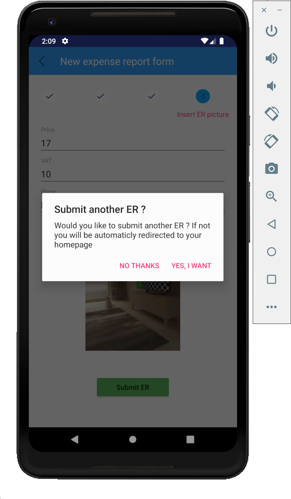
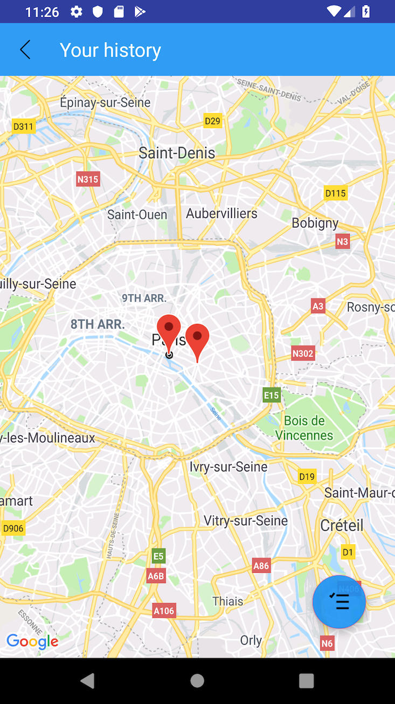
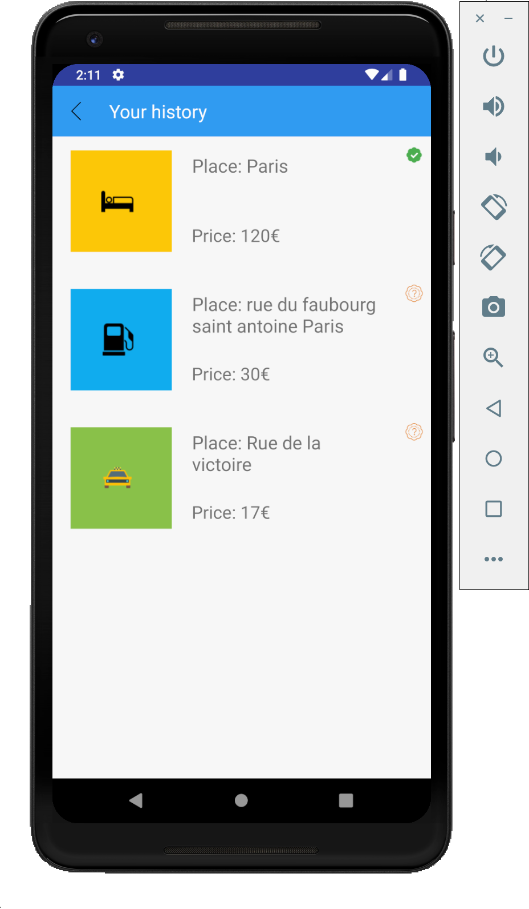
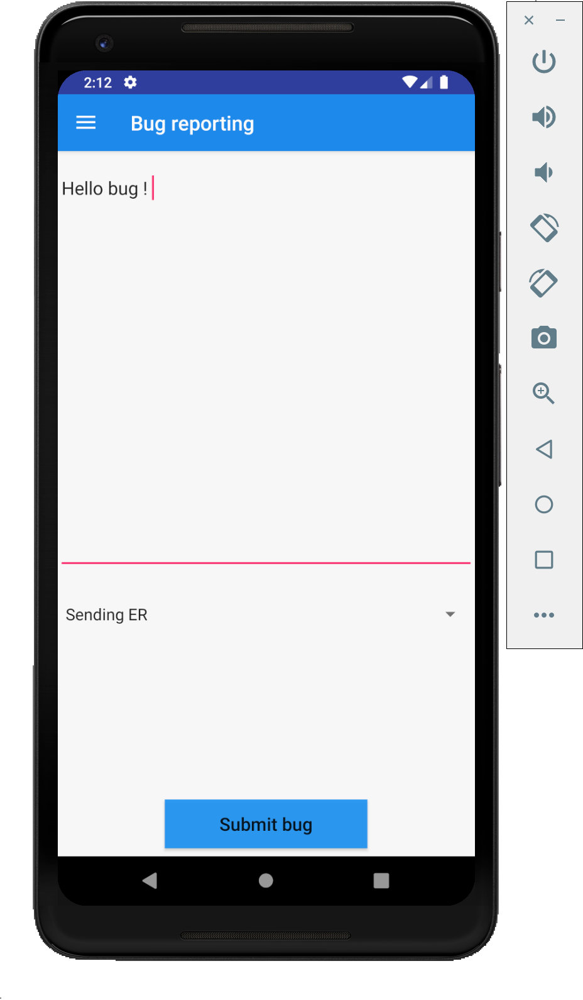

# ER Scan : Client Android (Employés)

Descriptif du client Android du projet ER Scan

## Introduction

ER Scan est un projet réalisé dans le cadre de la validation d'un Bachelor à l'ESGI en 3eme année MOC. Le but principal de ce projet vient d'une problématique rencontrée dans de nombreuses entreprises de nos jours, à savoir la gestion des notes de frais entre les employés et le pôle financier. Le projet étant divisé en 2 applications distinctes qui interagissent l'une avec l'autre pour permettre un suivi continu sur l'avancé du traitement des notes, des statistiques et une vision globale des dépenses dans l'entreprise. C'est un moyen rapide, intuitif et sur de remboursement des frais engagés par les employés. Dans ce descriptif nous allons voir les fonctionnalités qui sont fournies par l'application au xemployés pour leur faciliter la saisie de leurs notes de frais à savoir: 
- L'envoi d'une note de frais au pôle financier
- Suivi de l'historiques des notes de frais avec un double affichage Map/Listing
- Un récapitulatif avec les informations pertinantes sur la situation actuelle de l'utilisateur

## Connexion : 

Dans un premier temps avant d'utiliser l'application ER Scan, côté administratif une entreprise doit avoir été créée par le chef de l'entreprise. Ce dernier se chargera d'ajouter des membres à son staff pour qu'ils puissent à leur tour gérer l'ajout des employés. En effet il est impossible de se créer un compte en tant qu'employé directement depuis l'application, il faudra dans un premier temps attendre qu'un membre du staff vous ait créé un compte dans l'entreprise. Une fois le compte créé, il est directement utilisable en passant par l'authentification par mail et mot de passe. un mot de passe temporaire  sera fourni pour la première connexion par le membre du staff qui aura ajouté l'utilisateur. Il pourra être modifié après connexion dans les paramètres du compte. Aprés là connexion, un token d'authentification (JWT) est fourni à l'utilisateur avec un durée de validité de 7h et l'utilisateur sera directement invité à se reconnecter si l'application n'est pas utilisée plus de 24h.

## Page d'accueil : 

1- Récapitulatifs concernant les notes de frais du mois

- Somme totale
- Nombre de notes acceptées
- Nombre de notes refusées

2- Liste des 3 dernières notes de frais soumises par l'utilisateur

## Ajout d'une note de frais : 

Dans cette partie qui est la partie la plus importante de l'application, on arrivera d'abord sur un écran nous affichant un choix varié de type de notes de frais. Une fois le type de la note de frais séléctionné (en cliquant sur le type voulu) l'utilisateur se voit redirigé vers une page où il devra remlpir un petit formulaire avec les informations importantes concernant la dépense éffectuée (prix, tva, lieux et preuve d'achat).

## Historique : 

La page d'historique permet à l'utilisateur d'avoir une vision sur chaque note de frais qu'il a effectué. Il peut avoir un affichage avec des points sur une carte ou alors un affichage plus lisible sous forme de liste: 

## Bugs : 

La page de bug est mise à disposition de l'utilisateur pour lui permettre de soumettre d'eventuels problèmes rencontrés lors de l'utilisation de l'application. Les bugs qui sont receuillis par nos soins et qui sont réglés dans les plus brefs delais pour ameliorer l'utilisation de l'application.

### Ce projet est un projet scolaire, nous sommes ouvert à toutes propositions d'améliorations. :)

©WaraboProduction-2019
